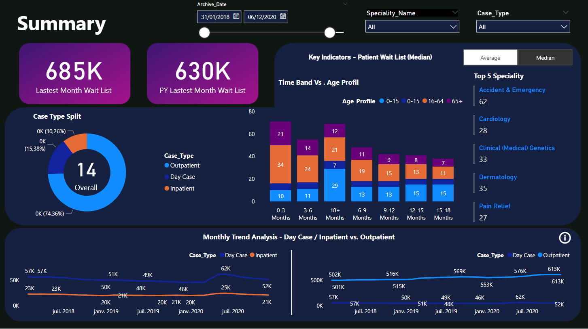
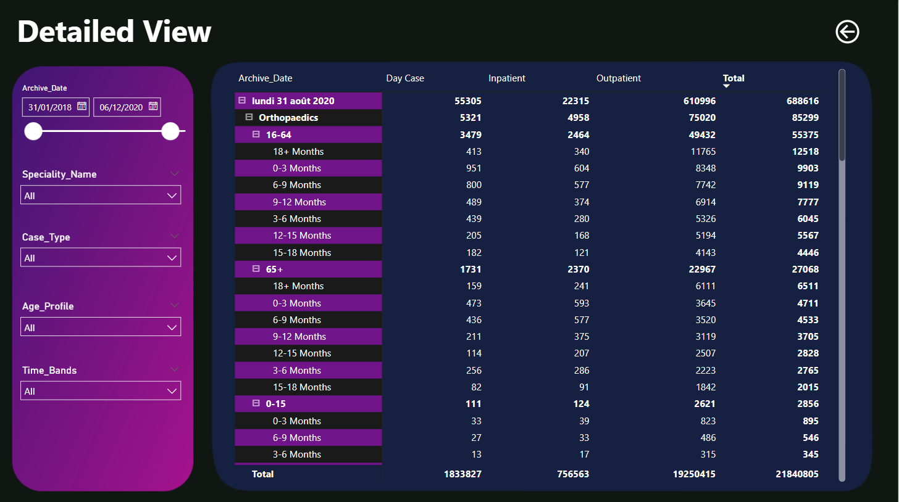
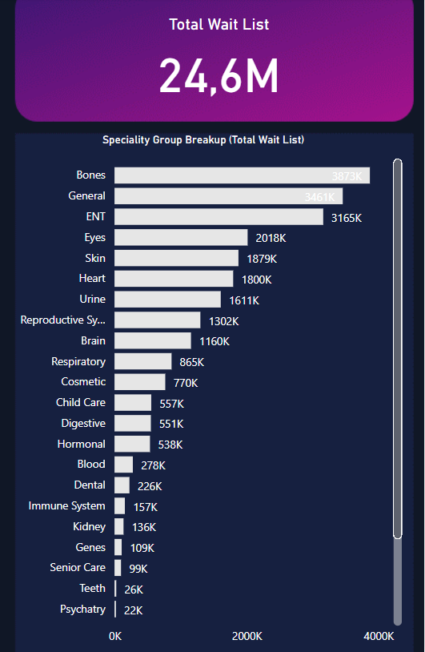
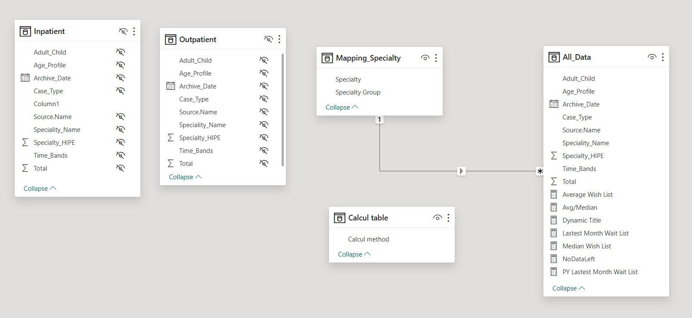

# 🩺 End-to-End Healthcare Dashboard Development — Power BI

This project is a **comprehensive Power BI dashboard** developed for the healthcare industry, simulating a real-world scenario of analyzing patient visit data across departments and demographics. It demonstrates my ability to handle the **full BI development cycle** — from raw data to business-ready visuals — using best practices in **data modeling, transformation, DAX, and UX design**.

The dashboard is structured into **three pages**, each tailored to a specific user need:

1. **Dashboard Page** – High-level KPIs and trends  
2. **Detailed Page** – Granular analysis and filtering  
3. **Drill-Down Page** – Focused views by Speciality Group (Total Wait List)

---

## 🧠 Objective

Build an interactive dashboard that enables healthcare professionals and management to monitor:
- Patient visit trends over time
- Department workload
- Demographic breakdown (gender, age)
- Key KPIs for operational decision-making

---

## 📸 Dashboard Previews

### 🖼️ Dashboard Page – Executive Overview  


### 🖼️ Detailed Page – Operational Analytics  


### 🖼️ Drill-Down Page – Contextual Focus  


---


## 🛠️ Tools & Technologies

| Tool             | Usage                                |
|------------------|--------------------------------------|
| Power BI Desktop | Data modeling, visualization         |
| Power Query      | Data transformation (ETL)            |
| DAX              | Calculated columns, measures & KPIs  |
| Excel            | Initial data source (patient data)   |
| Star Schema      | Efficient data structure             |


---


## 🧩 Model View – Power BI Relationships

The data model follows a **star schema**, where fact data from `All_Data` is connected to dimension tables like `Mapping_Specialty` and `Calcul table`.  
This enhances performance and simplifies visual filtering.




---


## 🔍 Business Questions Answered

✅ How many patients visited the hospital over time (daily, monthly)?  
✅ Which departments are the busiest?  
✅ What is the gender and age distribution of patients?  
✅ Are there any notable trends across time or categories?  
✅ How can healthcare staff allocate resources more efficiently?

---

## 📁 Project Structure

```
📂 Healthcare-powerbi-dashboard-project/
├── 📄 HealthcareDashboard.pbix                  # Power BI file
│
├── 📁 Data-Mapping/
│   └── 📁 Data/
│       ├── 📁 inpatient/
│       │   ├── 📄 IN_WL_2018.csv
│       │   ├── 📄 IN_WL_2019.csv
│       │   ├── 📄 IN_WL_2020.csv
│       │   └── 📄 IN_WL_2021.csv
│       │
│       ├── 📁 outpatient/
│       │   ├── 📄 OP_WL_2018.csv
│       │   ├── 📄 OP_WL_2019.csv
│       │   ├── 📄 OP_WL_2020.csv
│       │   └── 📄 OP_WL_2021.csv
│       │
│       ├── 📄 Mapping_speciality.csv            # Specialty mapping table
│
│   └── 📁 Background/
│       ├── 🖼️ slide1.png
│       ├── 🖼️ slide2.png
│       └── 🖼️ slide3.png
│
├── 📁 images/
│   ├── 🖼️ Dashboard_preview.PNG                 # Main dashboard screenshot
│   ├── 🖼️ Detail_preview.PNG                    # Detail view screenshot
│   └── 🖼️ Drill_Down_preview.PNG                # Drill-down screenshot
│   └── 🖼️ Model_view.PNG                # Drill-down screenshot
│ 
📄 README.md                                 # Project documentation
```

---

## 🔄 End-to-End Development Process

### 1. Data Acquisition & Exploration
- Imported Excel data representing patient visits, department info, and demographics
- Assessed data quality and column types

### 2. Data Cleaning (Power Query)
- Renaming columns
- Rearranging columns
- Appending two tables
- Replacing & trimming values

### 3. Data Modeling (Summary)
- **inpatient** and **outpatient** tables merged into a unified table: `All_Data`
- Original tables hidden and excluded from loading to optimize performance
- `Specialty_Name` column grouped using `Mapping_speciality.csv` to simplify visuals

📌 Relationships created:
```
All_Data[Specialty_Name] → Mapping[Specialty]
```

This grouping improves dashboard readability and usability by using high-level specialty categories.

### 4. DAX Measures

**Key Metrics Created Using DAX:**

```DAX
-- Latest vs Previous Year Wait List
Latest Month Wait List = CALCULATE(SUM(All_Data[Total]), All_Data[Archive_Date] = MAX(All_Data[Archive_Date])) + 0

PY Latest Month Wait List = CALCULATE(SUM(All_Data[Total]), All_Data[Archive_Date] = EDATE(MAX(All_Data[Archive_Date]), -12)) + 0

-- Additional KPIs
Median Wait List = MEDIAN(All_Data[Total]) 

Average Wait List = AVERAGE(All_Data[Total]) 

Avg/Med Wait List = SWITCH(
    VALUES('Calculation Method'[Calc Method]),
    "Average", [Average Wait List],
    "Median", [Median Wait List]
)

-- Dynamic Chart Titles
Dynamic Title = SWITCH(
    VALUES('Calculation Method'[Calc Method]),
    "Average", "Key Indicators - Patient Wait List (Average)",
    "Median", "Key Indicators - Patient Wait List (Median)"
)

-- Custom Messages for No Data
NoDataLeft = IF(
    ISBLANK(CALCULATE(SUM(All_Data[Total]), All_Data[Case_Type] <> "Outpatient")),
    "No data for selected criteria",
    ""
)

NoDataRight = IF(
    ISBLANK(CALCULATE(SUM(All_Data[Total]), All_Data[Case_Type] = "Outpatient")),
    "No data for selected criteria",
    ""
)
```

---

## 🙏 Acknowledgments

Special thanks to [Pivotal Stats](https://pivotalstats.com/end-end-power-bi-dashboard-development/) for providing the tutorial and dataset that served as the foundation for this project.

---
